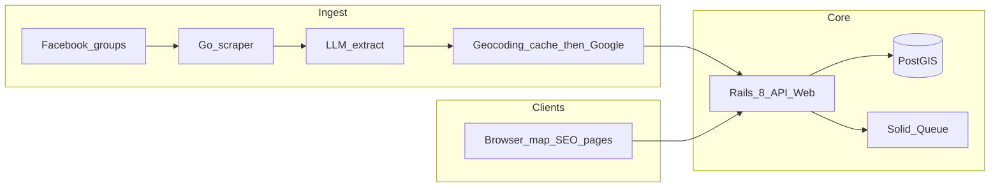

# Architecture — SportMatch

## [All] Tổng quan

Hệ thống gồm **Rails 8** (web + JSON API + PostGIS), service **Go** (thu thập + LLM + geocode cache-first), và **Solid Queue** cho xử lý nền. Người dùng truy cập web (SEO + map).

## [All] Sơ đồ luồng dữ liệu

## [Backend] Ranh giới trách nhiệm

| Thành phần | Trách nhiệm |
|------------|-------------|
| **Rails** | CRUD listing thủ công; API map feed; ingest đã ký từ Go; persist `geography`; SEO views; job nội bộ (Solid Queue) |
| **Go scraper** | Fetch nguồn (theo chính sách đã nêu trong SCRAPER_AGENT); gọi LLM; validate schema; geocode (DB cache trước); POST ingest Rails |
| **PostgreSQL/PostGIS** | Nguồn chân lý địa lý + cache geocoding (bảng cache hoặc cột denormalize — xem DATA_MODEL) |
| **LLM provider** | Chỉ trả JSON hợp lệ với [listing_extraction.schema.json](schemas/listing_extraction.schema.json) |

## [Backend] Idempotency ingest

- Mỗi tin từ Facebook (hoặc nguồn tương tự) có **`source_url`** cố định.
- Rails (hoặc constraint DB) đảm bảo không tạo trùng listing cho cùng `source_url` khi ingest lặp lại.

## [Frontend] Trang map vs trang SEO

- Trang chi tiết listing: **Rails HTML** (Turbo/Stimulus) để tối ưu SEO.
- Trang/map browse: **React island** bundle `jsbundling-rails` (ADR-001) với clustering và icon theo môn.

## [All] Tài liệu liên quan

- [API_CONTRACTS.md](API_CONTRACTS.md)
- [SCRAPER_AGENT.md](SCRAPER_AGENT.md)
- [MAPS_AND_COSTS.md](MAPS_AND_COSTS.md)
