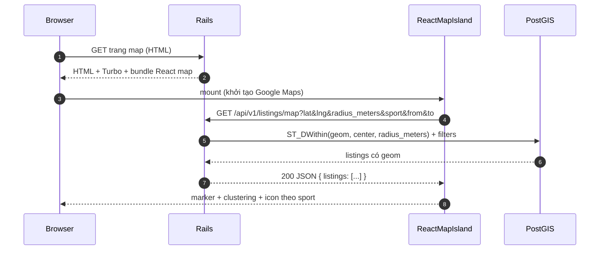
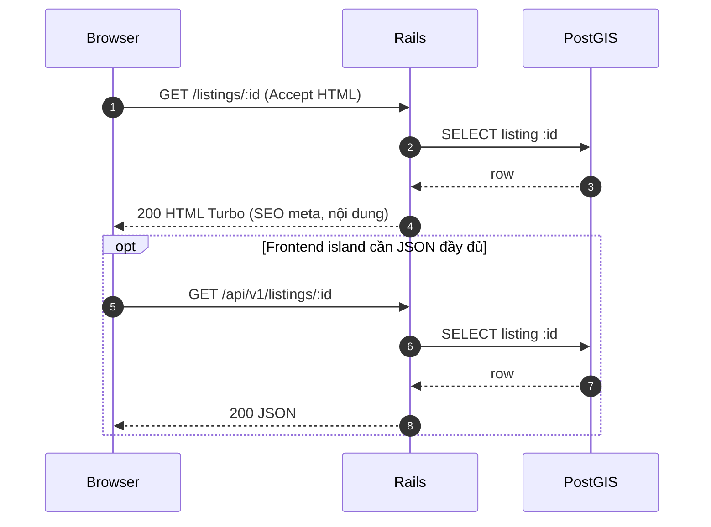
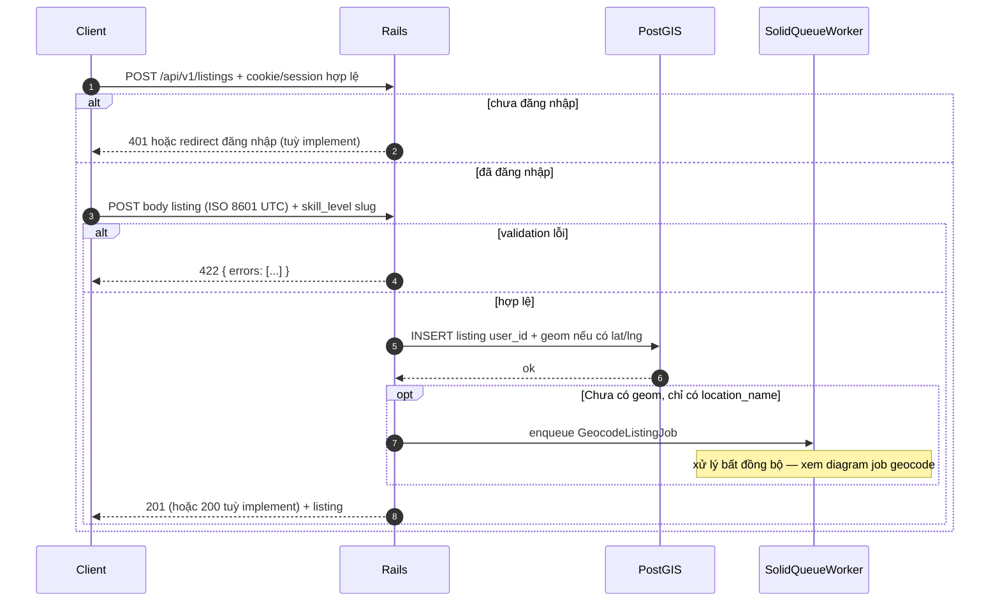
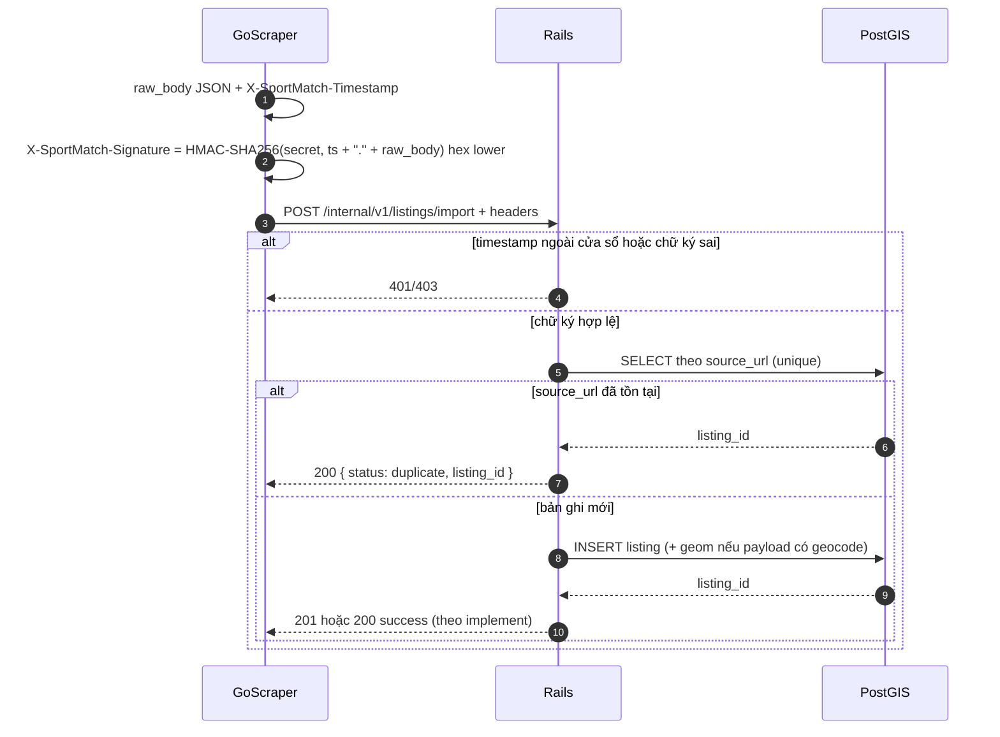
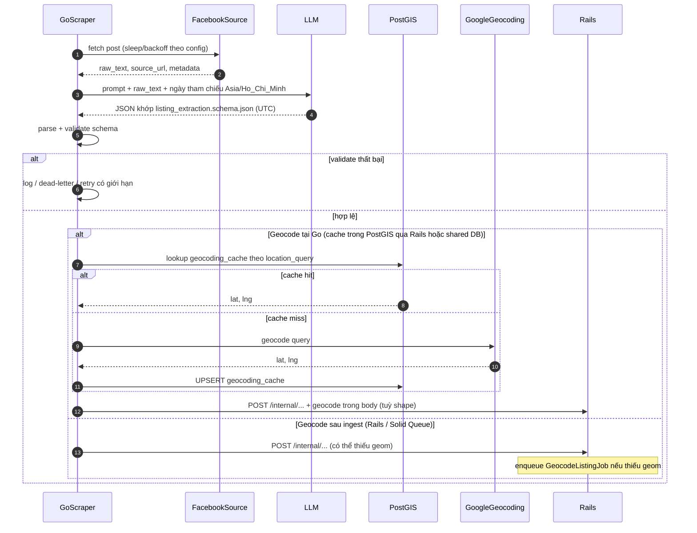
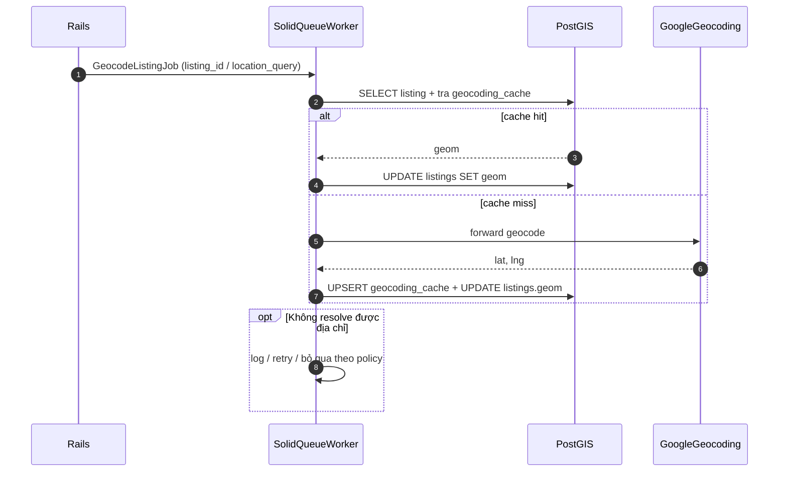
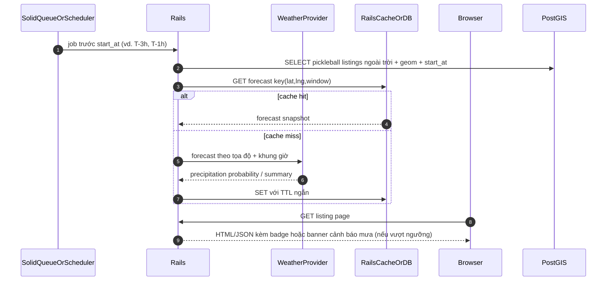

# Flow sequence diagrams — SportMatch

Tài liệu bổ sung [ARCHITECTURE.md](ARCHITECTURE.md): **sequence diagram** (Mermaid) cho các luồng MVP và wildcard roadmap. Thời gian API/DB theo **UTC** ([ADR-003](decisions/003-timezone-storage.md)).

## Mục lục

- [Quy ước participant](#quy-ước-participant)
- [MVP — Duyệt bản đồ (map feed)](#mvp--duyệt-bản-đồ-map-feed)
- [MVP — Chi tiết tin (SEO + Turbo)](#mvp--chi-tiết-tin-seo--turbo)
- [MVP — Tạo listing thủ công](#mvp--tạo-listing-thủ-công)
- [MVP — Ingest có chữ ký (Go → Rails)](#mvp--ingest-có-chữ-ký-go--rails)
- [MVP — Pipeline Facebook → LLM → geocode → ingest](#mvp--pipeline-facebook--llm--geocode--ingest)
- [MVP — Job geocode nền (Solid Queue)](#mvp--job-geocode-nền-solid-queue)
- [Roadmap — Uy tín / check-in](#roadmap--uy-tín--check-in)
- [Roadmap — Thời tiết pickleball](#roadmap--thời-tiết-pickleball)

## Quy ước participant

| Id trong diagram | Ý nghĩa |
|------------------|---------|
| `Browser` | Trình duyệt người dùng |
| `ReactMap` | React island trên trang map ([ADR-001](decisions/001-map-frontend-react-esbuild.md)) |
| `Rails` | Rails 8 web + API |
| `PostGIS` | PostgreSQL + PostGIS (listings, `geocoding_cache`) |
| `SolidQueueWorker` | Worker Solid Queue |
| `GoScraper` | Service Go (scrape + orchestrate) |
| `FacebookSource` | Nguồn bài đăng (Facebook / tương đương) |
| `LLM` | Nhà cung cấp LLM (JSON schema) |
| `GoogleGeocoding` | Google Geocoding API |

Chỉ các diagram **Roadmap** dùng `UserAuth`, `ListingOwner`, `WeatherAPI` — hợp đồng API chi tiết có thể bổ sung sau.

---

## MVP — Duyệt bản đồ (map feed)

Theo [API_CONTRACTS.md](API_CONTRACTS.md) `GET /api/v1/listings/map`, [MAPS_AND_COSTS.md](MAPS_AND_COSTS.md) (clustering, icon theo môn).



---

## MVP — Chi tiết tin (SEO + Turbo)

Theo [API_CONTRACTS.md](API_CONTRACTS.md): HTML `GET /listings/:id`; JSON `GET /api/v1/listings/:id` (tuỳ chọn).



---

## MVP — Tạo listing thủ công

Theo [API_CONTRACTS.md](API_CONTRACTS.md) `POST /api/v1/listings`: **cần đăng nhập**; `skill_level` là slug mới ([listing_extraction.schema.json](schemas/listing_extraction.schema.json)). Có thể enqueue geocode khi thiếu `geom` ([SCRAPER_AGENT.md](SCRAPER_AGENT.md)).



---

## MVP — Ingest có chữ ký (Go → Rails)

Theo [API_CONTRACTS.md](API_CONTRACTS.md), [ADR-002](decisions/002-scraper-to-rails-auth.md): HMAC trên `timestamp + "." + raw_body`, cửa sổ thời gian, idempotent `source_url`.



---

## MVP — Pipeline Facebook → LLM → geocode → ingest

Theo [SCRAPER_AGENT.md](SCRAPER_AGENT.md): rate limit, validate schema, geocode **cache-first**, rồi POST internal import. Hai cách triển khai geocode được tài liệu cho phép.



---

## MVP — Job geocode nền (Solid Queue)

Khi listing không có `geom`, [SCRAPER_AGENT.md](SCRAPER_AGENT.md) cho phép job retry; map feed có thể ẩn tin cho đến khi có `geom`.



---

## Roadmap — Uy tín / check-in

**Wildcard** — chi tiết API chưa có trong [API_CONTRACTS.md](API_CONTRACTS.md); tham chiếu [FEATURE_ROADMAP.md](FEATURE_ROADMAP.md), [DATA_MODEL.md](DATA_MODEL.md) `reputation_events`.

```mermaid
sequenceDiagram
  autonumber
  participant Participant as ParticipantUser
  participant Owner as ListingOwner
  participant Rails
  participant PostGIS

  Note over Participant,PostGIS: Sau start_at; người đã join xác nhận tham gia

  Participant->>Rails: submit participation confirmation
  Owner->>Rails: confirm counterpart(s)

  Rails->>PostGIS: INSERT reputation_events (points_delta, listing_id, user_id, event_type)
  PostGIS-->>Rails: ok
  Rails-->>Participant: updated reputation/profile (khi có auth đầy đủ)
```

---

## Roadmap — Thời tiết pickleball

**Wildcard** — provider và endpoint cụ thể chọn khi implement; [FEATURE_ROADMAP.md](FEATURE_ROADMAP.md).



## Liên kết

- [ARCHITECTURE.md](ARCHITECTURE.md)
- [API_CONTRACTS.md](API_CONTRACTS.md)
- [SCRAPER_AGENT.md](SCRAPER_AGENT.md)
- [MAPS_AND_COSTS.md](MAPS_AND_COSTS.md)
- [FEATURE_ROADMAP.md](FEATURE_ROADMAP.md)
